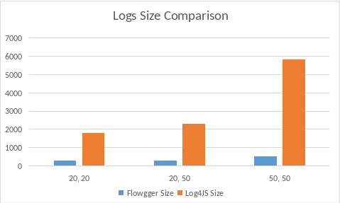

# Flowgger

Flowgger is a logging framework. Unlike other traditional logging tools, Flowgger requires users to define the flow of their code in advance in `.stflow` files. Flowgger matches logging statements against this predefined flow and logs only the step id. This reduces the size of logs drastically.

Additionally, users get all relevant information in a single log entry, such as the execution time of each step and the entire flow, sequence of steps, flow status, etc.

> You can use [Text2Chart](https://solothought.com/text2chart/) to visualize `.stflow` files in VS code IDE.

This innovative approach benefits users in two significant ways:
1. **Reduced Log Size:** Logs are minimal, resulting in faster logging and reduced storage requirements.
2. **Efficient Debugging:** Flowgger significantly reduces debugging time—from days to minutes—by providing structured, minimal logs.


## Features

Beyond log size reduction, Flowgger offers additional features.

### Dynamic logging

#### Categorization

You can pass an optional parameter, key, when logging extra information.
```js
flog.debug("short msg", stacktrace, "key");
```

Suppose you are rolling out a new version of your application and need additional logging for testing. You can assign a key to these logs and later disable them after testing is complete. This requires no additional deployment or restart.

#### Pause logs based on type of flow name

Flowgger allows selective enabling (play) or disabling (pause) of logs for specific flows, log types, or keys.

```
flowgger.play(config);
flowgger.pause(config);
```

### Filter

You can write logs of a particular flow to a specific stream using `onlyFor` and `notFor` filters. You can also filter based on the type. Eg. You want to be notified on email or on chat for errors.

```js
const errAppenderConfig = {
  handler: log4jsErrAppender,
  onlyFor: {
    types: ["error"],
    flows: ["flow name"]
  }
}
```

# Quick Guide

Here is the quick guide about how to integrate Flowgger in an application. You may check detail explanation [here](./docs/1.GettingStarted.md).

```js
import Flowgger from '@solothought/flowgger';

const config = {
    "appenders": [
      {
        handler: appenderFn,
        layout: lr ,
        onlyFor: {
          types: [],
          flows: []
        }
      },
    //..
    ],
    flow: {
      source: path.resolve("./tests/flows"),
      // maxIdleTime: 200, // time difference between two consecutive steps
    }
}


 //flowgger should be created once and on application level
const flowgger = new Flowgger(config)

// Each endpoint must use Flowgger instance to get a logger instance using 'init' before stating logging
// Flow name passed in 'init' must match to one flow defined in 'stflow' files.
const binFlow = flowgger.init("Binary Search");

// All consecutive code should use non-branching, non-leaving steps from the flow
// using 'info' method
binFlow.info("read low");

//order of the steps in code is most important
binFlow.info("read high");

//You can log additional data using 'debug', 'error', 'warn' methods
binFlow.debug("values", {low: lowVal, high: highVal});

// It is recommended to call 'end' when the flow ends expectedly or divert to unexpected path
binFlow.error("NULL POINTER EXCEPTION", e.stackTrace())
binFlow.end()
```

# Log Size Comparison

The graph below compares the log size produced by Flowgger versus a traditional logging framework.

1. In first comparison, I've used 20 logs statements where the size of each log statement is 20 chars on average
2. In second comparison, I've used 20 logs statements where each log statement is 50 chars long on average.
1. In 3rd comparison, I've used 50 logs statements with 50 chars long log message on average



<small>Smaller is good.</small>

Above graph highlights the difference for 1 API call. Suppose you have 10 APIs, Flowgger will generate a log file of 2.75 mb for 1000 requests to each API, where the other frameworks will generate a log file of 22.3 mb. Here, we've considered 20 log statements per API with 50 chars in each statement on average.

Consideration: In this comparison, it is considered that there is no extra debug, error, or other logs. All the log statements define the flow of application. 